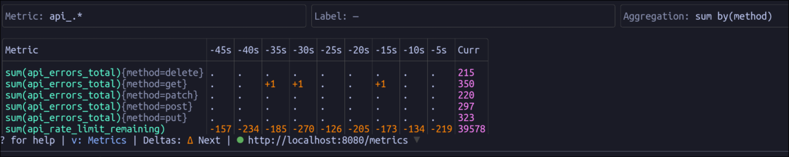
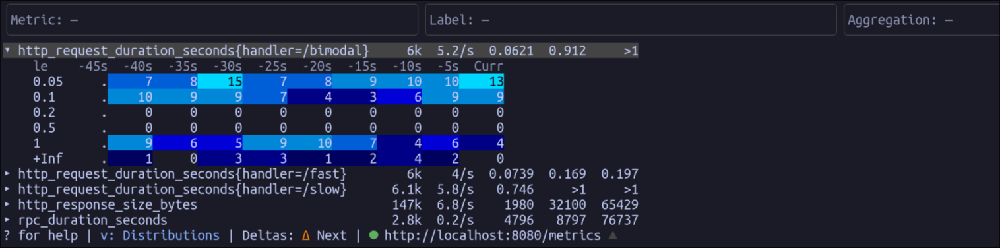

# openmetrics-tui

A terminal-based tool to monitor OpenMetrics/Prometheus metrics in real-time. A
simple alternative to `watch curl http://... | grep metric_*` workflows.

Metrics view:



Distributions view:



## Filtering and aggregation

Each of the three takes the same syntax on the command line and in the TUI, so
the examples below show the value alone.

### Metric filter

An unanchored regex matched against the metric name. Pass it as
`-filter-metric`, or press `m` to edit it live (`enter` applies, `esc`
discards).

```
http_requests
^go_(gc|memstats)
requests_total|errors_total
```

### Label filter

A comma-separated list of clauses, all of which must match. Pass it as
`-filter-label`, or press `f` to edit it live. A missing label reads as the
empty string, the way PromQL treats it, so `env!=dev` also admits series with no
`env` label.

```
env=prod            label equals a value
env!=dev            label does not equal a value
env=~prod|stg       label matches a regex
env!~dev|test       label does not match a regex
code=               series lacking the label
env!=               series carrying the label, whatever its value
5..                 bare regex, tried against every label value (not its name)
env=prod,code=~5..  all clauses must match
path=~/a{1,2}       commas inside {} or [] need no escaping; use \, elsewhere
```

### Aggregation

Combines series that differ only in the labels you name. Pass it as
`-aggregation`, or press `a` to edit it live. The operator is optional and
defaults to `sum`; grouping never crosses metric names.

```
pod                 sum series that differ only in pod
pod,instance        sum over both labels
avg pod             avg, min, max and count also work
count               no grouping labels: one row per metric
sum by (pod)        the PromQL spelling, if you prefer it
```

Histograms fold with `sum` only; summaries are never folded and pass through
untouched.

### Label display

A label the filter pins to a value is dropped from the `{}` braces, because the
header already shows the filter and every visible series had to match it to be
there at all. Under `env=prod,code=~5..` a row reads
`http_requests_total{method=GET}`, not `{code=503,env=prod,method=GET}`.

A clause that pins nothing leaves its label alone: `env!=dev` admits prod and
staging both, so the column still says which one this row is. The same goes for
`env!~dev|test` and for a bare regex, which names no label to begin with.

Press `l` to cycle, or set `-label-mode`.

```
hide-filtered       the default, above
hide-all            no braces at all
all                 every label, filter or no filter
```

## Processing of metrics

The display has two independent axes. Deltas run _across time_, along a row, and
apply to every metric. Bucket mode runs _within a single sample_, down a
histogram's bounds. Neither knows about the other, so any pairing of the two
means what both names say it means, and both are shown at the bottom of the
screen.

### Deltas across time

Toggled with `d`, or set with `-delta-mode`.

- `Deltas: Off` - metrics show raw.
- `Deltas: Δ Next` - metrics columns show the delta to the next in the time
  series, except for the current column, which show the raw metric value.
- `Deltas: Δ View` - the current column shows the delta within the current view.

A counter that falls has been restarted rather than measured, so the drop reads
as missing (`.`) instead of a large negative number. A gauge is free to fall, and
keeps its negative delta.

### Buckets within a sample

Toggled with `b`, in the distributions view. A histogram's buckets are
cumulative as exported: `le=0.5` counts everything `le=0.1` already counted.

- `Buckets: Cumulative` - counts exactly as the exporter published them, rising
  as you read down towards `+Inf`.
- `Buckets: Per bucket` - each bucket less the one below it, so a row counts only
  the observations that fell in that band.

Either way the counts are lifetime totals; pair them with `d` to see what
arrived recently. Summary quantiles are latencies rather than counts, so bucket
mode leaves them alone.

A two-bucket histogram, scraped three times, under each pairing:

```
                              t-2  t-1  Curr        t-2  t-1  Curr
Deltas: Off                    10   14    20         10   14    20   le=0.1
                               30   40    55         20   26    35   le=+Inf
Δ Next                          4    6    20          4    6    20   le=0.1
                               10   15    55          6    9    35   le=+Inf

                          Buckets: Cumulative    Buckets: Per bucket
```
